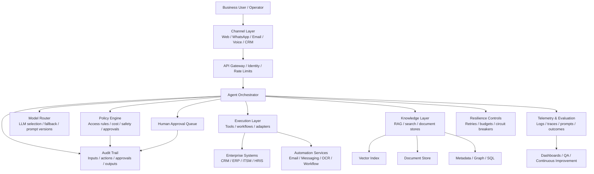

# Enterprise AI Agent Blueprint

Production-ready reference architecture, delivery checklist, and operating templates for enterprise AI agent systems.

This repository is designed for solution architects, delivery leads, and engineering teams who need to move beyond demos and design AI agents that are governable, observable, secure, and deployable in real enterprise environments.

## Why this exists

Many public AI-agent examples optimize for speed of demo. Enterprise teams need something else:

- clear separation between orchestration, tools, policies, and human approvals
- predictable failure handling and traceability
- environment boundaries, secrets handling, and access control
- measurement beyond model quality alone
- delivery artifacts that help teams align architecture, operations, risk, and rollout

This blueprint packages those concerns into a practical artifact that can be reused in workshops, client conversations, internal reviews, and implementation planning.

## What’s included

- **Reference architecture** for enterprise AI agent platforms
- **Mermaid diagram** you can paste into docs or GitHub pages
- **Production-readiness checklist** across architecture, security, ops, and governance
- **Non-functional requirements template** for solution scoping
- **Pilot-to-production rollout plan** template
- **Control-plane assessment scorecard** for workshops, readiness reviews, and advisory work
- **Workflow vs agent decision matrix** to choose the right autonomy pattern for a use case
- **Enterprise AI evaluation operating model template** to define scenario coverage, release gates, telemetry, and review cadence
- **Enterprise AI risk and approval matrix template** to define which AI actions can auto-execute, which require approval, and what evidence approvers should see
- **Example policy pack** showing how approvals and tool constraints can be expressed

## Reference architecture

## Design principles

1. **Treat the agent as a controlled system, not a magical endpoint**  
   Separate reasoning, policy, tool execution, and data access so each can be reviewed and improved independently.

2. **Use retrieval and tools deliberately**  
   Not every task needs an agent loop. Use deterministic workflows where possible, and reserve agentic behavior for ambiguous, multi-step tasks.

3. **Put approvals where business risk actually sits**  
   Human-in-the-loop should trigger on risk thresholds such as external communication, data mutation, financial impact, or policy exceptions.

4. **Design for auditability from day one**  
   Every important answer or action should be reconstructable: prompt version, model, retrieved evidence, tool calls, approvals, and final output.

5. **Measure business outcomes, not only model outputs**  
   Track containment, turnaround time, resolution quality, escalation rate, operator trust, and downstream business impact.

## Core architecture layers

### 1) Channel layer
Handles where requests originate.

Examples:
- web portal
- internal chat
- WhatsApp
- email
- voice bot
- CRM or ticketing front end

### 2) Agent orchestrator
Coordinates planning, memory, tool selection, execution steps, and state transitions.

Responsibilities:
- task decomposition
- prompt assembly
- step execution policy
- handoff management
- timeout and retry behavior
- state persistence

### 3) Policy engine
The most commonly skipped enterprise requirement.

Responsibilities:
- tool allow/deny lists by role
- environment restrictions
- PII and data handling rules
- approval thresholds
- model usage restrictions
- cost ceilings and usage budgets

### 4) Knowledge layer
Retrieval should be evidence-oriented, versioned, and traceable.

Recommended components:
- source registry
- ingestion pipeline
- chunking/versioning strategy
- vector and keyword retrieval
- metadata filters
- citation payloads
- freshness controls

### 5) Execution layer
Wrap external systems behind narrow, observable interfaces.

Patterns:
- adapter per system
- idempotent operations where possible
- dry-run mode for high-risk actions
- structured inputs/outputs
- explicit error taxonomy

### 6) Human approval queue
Use it for:
- sending customer-facing messages
- changing records in critical systems
- actions above financial/risk thresholds
- low-confidence cases
- policy overrides

### 7) Observability and evaluation
Minimum signals to capture:
- request volume and latency
- token/cost usage
- retrieval hit quality
- tool execution success/failure
- approval frequency and reasons
- business KPI outcome per workflow

## Delivery use cases this blueprint fits well

- customer support copilots with CRM and knowledge retrieval
- omnichannel engagement agents across WhatsApp, email, and web
- internal service desk or operations assistants
- document-heavy agent workflows using OCR and enterprise search
- partner or sales enablement assistants with controlled content grounding

## Production readiness checklist

See: [`checklists/production-readiness.md`](checklists/production-readiness.md)

Quick preview:
- [ ] tool access is role-bound and environment-scoped
- [ ] prompt/version changes are reviewable
- [ ] retrieval sources are registered and freshness-defined
- [ ] every external action is logged with actor, input, and outcome
- [ ] approval rules exist for high-risk operations
- [ ] evaluation includes business KPIs, not just answer quality
- [ ] rollback path exists for prompt, workflow, and model changes

## Repository structure

- `docs/reference-architecture.md` — architecture narrative and component responsibilities
- `checklists/production-readiness.md` — go-live checklist
- `templates/non-functional-requirements.md` — NFR template for discovery and design
- `templates/pilot-to-production-plan.md` — phased rollout template
- `templates/control-plane-assessment-scorecard.md` — 10-dimension readiness scorecard and workshop tool
- `templates/workflow-vs-agent-decision-matrix.md` — decision tool for choosing workflow vs bounded-agent patterns
- `templates/enterprise-ai-evaluation-operating-model.md` — evaluation template covering business outcomes, groundedness, tools, policy, operations, and release governance
- `templates/enterprise-ai-risk-and-approval-matrix.md` — approval-design template covering action classes, risk bands, approvers, evidence packets, escalation, and audit logging
- `offers/enterprise-ai-readiness-control-plane-review.md` — advisory offer package tied to the scorecard
- `examples/policy-pack.yaml` — example approval and tool policy configuration

## How to use this repo

### Option 1: Architecture workshop
Use the architecture diagram and NFR template to structure a 60–90 minute design session with stakeholders.

### Option 2: Proposal support
Reuse the design principles, layered architecture, and checklist as the backbone of a proposal or solution design document.

### Option 3: Delivery baseline
Fork the repo and adapt the templates for a real implementation team.

### Option 4: Readiness assessment workshop
Use the control-plane assessment scorecard to run a 60–90 minute session, identify the top 3 operating gaps, and define a 30/60/90-day improvement plan.

### Option 5: Workflow vs agent decision session
Use the workflow-vs-agent decision matrix to determine whether a use case should be implemented as a deterministic workflow, a workflow with bounded intelligence, or a more agentic pattern.

### Option 6: Evaluation operating model design
Use the enterprise AI evaluation operating model template to define must-pass scenarios, golden sets, release gates, telemetry requirements, and ongoing review cadence before broad production rollout.

### Option 7: Approval-design workshop
Use the enterprise AI risk and approval matrix template to define which actions can auto-execute, which require approval, what evidence approvers need, and how escalation should work for high-impact workflows.

## Audience

- enterprise AI architects
- solution engineering leads
- platform and governance teams
- delivery managers moving pilots into production

## Contributing

Open an issue or PR with improvements to the blueprint, especially from real delivery experience.

## License

MIT
